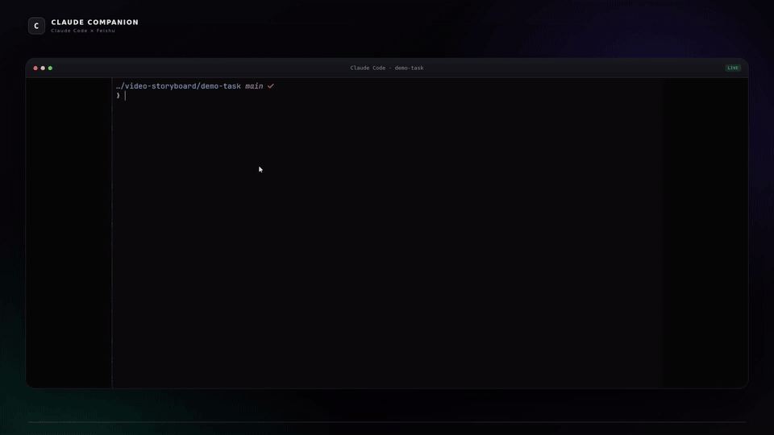
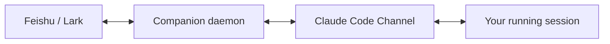

<h1 align="center">Claude Code Feishu Companion</h1>

<p align="center">
  Continue the same running Claude Code session from Feishu/Lark.
  <br>
  Native Claude Code Channel integration — no spawned agents, no replacement runtime.
</p>

<p align="center">
  <a href="https://github.com/marcelritzschke/claude-code-feishu-companion/actions/workflows/ci.yml"></a>
  <a href="https://github.com/marcelritzschke/claude-code-feishu-companion/releases/latest"></a>
  <a href="https://github.com/marcelritzschke/claude-code-feishu-companion/releases"></a>
  <a href="https://github.com/marcelritzschke/claude-code-feishu-companion/blob/main/go.mod"></a>
  <a href="LICENSE"></a>
</p>

<p align="center">
  🚀 <a href="#quick-start">Quick Start</a> ·
  📖 <a href="docs/setup.md">Docs</a> ·
  🔐 <a href="docs/security-and-operations.md">Security</a> ·
  📦 <a href="https://github.com/marcelritzschke/claude-code-feishu-companion/releases">Releases</a> ·
  🌐 <strong><a href="README.zh-CN.md">简体中文</a></strong>
</p>

<p align="center">
  
</p>

## Native Claude Code Channel — not a CLI bridge

Claude Code Feishu Companion connects Feishu/Lark through a native Channel to
the Claude Code process you already started. The original terminal stays
active and usable; Feishu is simply a remote entry point.

<table width="100%">
  <tr>
    <td>💡 <strong>Feishu/Lark for the Claude Code session you already have running — not another Claude harness.</strong></td>
  </tr>
</table>

Claude Code remains the runtime: it owns the session lifecycle, context,
tools, authentication, permissions, and native TUI. Claude Code Feishu
Companion only connects that running process to Feishu/Lark. It never launches
`claude -p`, introduces a separate Agent SDK harness, or creates another
Claude session.



## Quick start

One command installs the binary and opens QR-based Feishu onboarding.

On macOS or Linux:

```sh
curl -fsSL https://raw.githubusercontent.com/marcelritzschke/claude-code-feishu-companion/main/install.sh | sh
```

On Windows, in PowerShell:

```powershell
irm https://raw.githubusercontent.com/marcelritzschke/claude-code-feishu-companion/main/install.ps1 | iex
```

Both verify the download against the release's `checksums.txt` before
installing anything, and both put the binary on your `PATH`.

Scan the QR code to connect the app and make that Feishu account the owner.
Existing app credentials, manual setup, and configuration options are covered
in [Setup and configuration](docs/setup.md).

Start a session you want to continue remotely with:

```sh
claude --dangerously-load-development-channels server:claude-companion
```

Plain `claude` sessions still send notifications, but cannot accept remote
messages while Claude Code Channels remain in preview.

## At a glance

| Capability | What you get | Status |
| --- | --- | --- |
| Existing Claude Code sessions | Keep the terminal session you already have open. | ✅ |
| Session discovery | Choose the exact running session from Feishu/Lark. | ✅ |
| Notifications | Hear only when Claude needs you or finishes. | ✅ |
| Remote continuation | Send follow-ups into the selected existing session. | ✅ Preview |
| Live watch | Follow progress in one card that updates in place. | ✅ |
| Remote interrupt | Stop the current turn without ending the session. | ✅ macOS/Linux |
| Permission decisions | Approve or deny requests from Feishu/Lark. | ✅ Optional |
| QR onboarding | Scan once to connect the app and your machine. | ✅ |
| macOS / Linux | Use the complete companion workflow. | ✅ |
| Windows | Use the workflow with platform-specific limitations. | 🧪 Partial |
| Bedrock / Vertex / Foundry | Receive notifications, but not remote continuation. | ❌ Channel limitation |

## User experience

- **Quiet by default.** Feishu surfaces questions, permission requests, and
  completion summaries—not every file read, command, or tool call.
- **Exact-session control.** Send `sessions`, choose a running session, and
  every follow-up goes only there. Ended sessions are never silently replaced.
- **One live card.** Send `watch` to follow progress in place. Tap
  **Interrupt**, or send `interrupt`, to stop the current turn without ending
  the session.

## How it works and security

A lightweight local daemon maintains the Feishu connection and discovers
local Claude Code sessions. Hooks provide lifecycle and attention events;
Claude Code Channels carry messages into the selected running session.

Sessions, context, authentication, and tools stay local and user-owned. Only
the configured Feishu owner can send inbound messages, and remote permission
decisions are separately configurable. Companion sends focused cards—not a
terminal stream, complete transcript, or model reasoning.

See [Security and operations](docs/security-and-operations.md) for the full
trust boundary and the
[product experience specification](docs/product-experience-spec.md) for the
design rationale.

## Current limitations

- Remote continuation requires the preview flag shown above because Claude
  Code Channels are a research preview and Companion is not yet allowlisted.
- Channels require Anthropic authentication through claude.ai or a Console
  API key. They are unavailable on Bedrock, Vertex, and Foundry. Team and
  Enterprise organizations must enable Channels centrally.
- Claude Code multiple-choice `AskUserQuestion` prompts cannot currently be
  answered through a Channel; answer them in the original terminal.
- The computer, Claude Code session, Claude Code Feishu Companion daemon, and
  network connection must remain running for remote continuation.
- WSL and native Windows are separate installations, each needing its own
  binary and `init`. Remote interrupt is not available on Windows.

## Contributing

```sh
mise install
mise exec -- go test ./...
mise exec -- go build -o claude-companion .
```

The repository pins its Go toolchain with [mise](https://mise.jdx.dev/). Setup
and diagnostic commands are documented in [Setup and configuration](docs/setup.md)
and [Security and operations](docs/security-and-operations.md).
